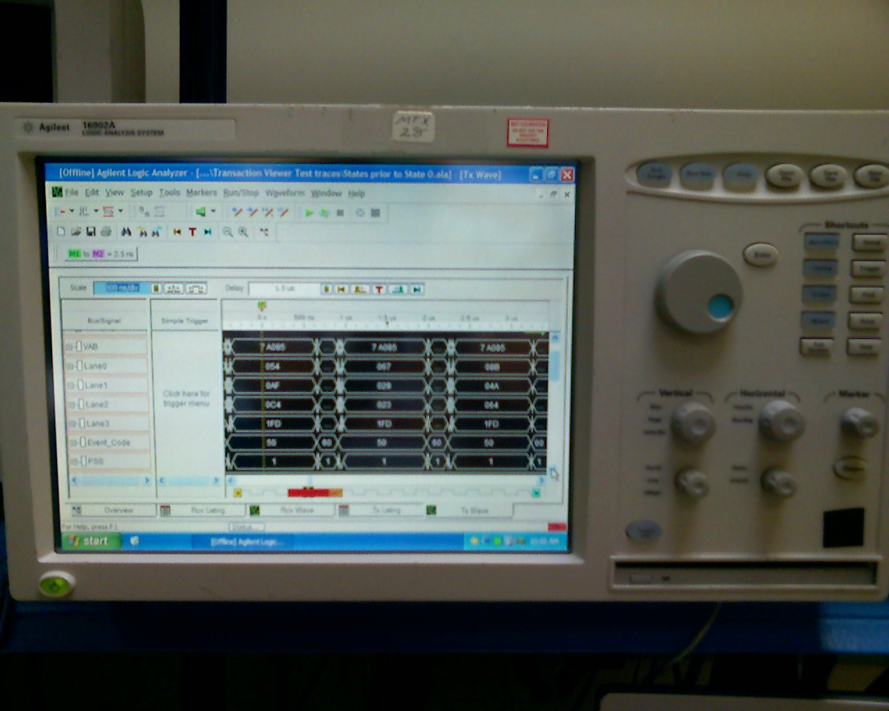
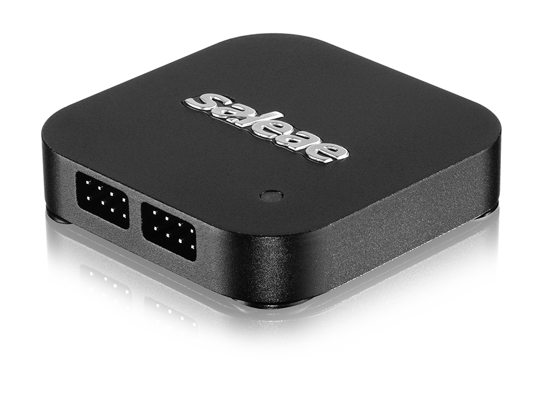

# Choosing a Logic Analyzer

If you are in the market for a logic analyzer, how do you know which one is right for you? There are many options to choose from, and looking at the various technical specifications can be intimidating. This article will give you some potential features to think about when considering your purchase.

### Form Factor

The first important decision to make is what kind of logic analyzer do you want? They come in three different forms: portable, modular, and PC-based. Each form factor has its own set of advantages and disadvantages worth considering.

#### Portable

Portable logic analyzer are generally large boxes intended to sit on a workbench. Similar to an oscilloscope, they usually have a screen and a number of knobs and buttons to navigate the various menus. Many modern portable analyzers are simply cases wrapped around a computer that runs an operating system, such as Windows.

While some can have relatively large viewing areas, they often pale in comparison to the size and real estate you might get from a traditional desktop computer monitor. Staring at a small screen for long periods of time can be painful.

The name "portable" comes from the fact that the logic analyzer components are completely self-contained. Many have large handles that allow you to move the units, should the need arise. However, some are quite large and can weigh over 30 pounds, which can make it difficult to physically move such equipment.

Despite their bulkiness, portable logic analyzers can contain specialized hardware that allow you to measure signals at higher frequencies. As they do not require a separate computer, you are not limited by connection speeds, such as USB and Ethernet.

#### Modular

Modular logic analyzers can be rack-mounted or cards that slide into a backplane. You can swap out various modular units to create a unique test equipment setup for your specific needs.

Most often, modular analyzers require computer software to control collection and analyze data. Having a separate computer gives you a potentially larger screen and an easier path to upgrade the software. However, you are limited by the connection speeds \(for example, USB or Ethernet\) between the test equipment and computer.

While the individual modules might be small \(able to fit in the palm of your hand\), they cannot work without the proper backplane. These backplanes can be anywhere from the size of a shoe box to a small room.

#### PC-Based

PC-based logic analyzers are similar to modular analyzers in that they require host computers to control the capture parameters and display waveforms. However, they do not require a backplane to operate. 

Because of the reliance on a host computer for command and control, PC-based analyzers are limited by their connection speed. Be aware of the type of connection available. For example, USB 3.0 offers higher data rates than USB 2.0.

However, because you need a computer to operate such a logic analyzer, the software is easy to upgrade, and you have the option of using one or more larger screens to help you debug. Additionally, when paired with a laptop, small PC-based analyzers can be extremely portable, which can be advantageous if you are debugging a circuit in a car or at a conference.

### Technical Specifications

As you shop for logic analyzers, you will come across a plethora of technical specifications. It can be helpful to think about what kinds of circuits you wish to debug before looking at the various specs. For example, are you working with low speed protocols, such as UART and I2C? Do you require dozens of channels to characterize a complicated FPGA circuit? Or are you trying to debug high speed signals like Ethernet and HDMI?

In this section, we'll go over some of the important specifications that you might find. Note that portable-type logic analyzers will generally have the best specifications at the cost of portability and ease-of-use.

#### Channel Count

The most apparent specification is the number of channels available on the logic analyzer. A single channel is an input line with the ability to sample and measure a signal. It is not uncommon to find logic analyzers with 8, 16, 32, and more channels.

If you plan to examine protocols with few signal lines, such as I2C, SPI, Ethernet, USB, CAN, and HDMI, you will not need more than 8 or 16 channels. On the other hand, if you are planning to debug parallel communication buses, such as PCI, ATA, and SCSI, you will want at least 32 channels.

Performing a [state mode analysis](how-to-use-a-logic-analyzer.md#sampling-modes) of digital components, like FPGAs, microcontrollers, and memory, may require many channels, and some logic analyzers can contain more than 100 channels to assist with these complex circuits.

#### Sample Rate

The sample rate determines the shortest interval in which your analyzer can take a measurement from each of the signals. For example, a sample rate of 100 MS/s \(mega-samples per second\) means that your analyzer can sample a signal 100,000,000 times per second.

The Nyquist-Shannon sampling theorem states that you must sample more than twice the frequency of your original signal to be able to reconstruct that signal. That being said, a good rule of thumb is that you need to sample a **digital signal at least 4 times faster** than its frequency, and you want to sample an **analog signal at least 10 times faster** than its frequency.

As an example, if you are planning to debug a SPI bus, which can reach up to speeds of 25 MHz, you would want an analyzer with a sampling rate of at least 100 MS/s.

#### Bandwidth

Bandwidth is describes the maximum frequency that the front end of the analyzer can handle. Unlike sample rate, the bandwidth is determined by the analog components used in the probes and buffers.

This video does a great job of describing the differences between bandwidth and sample rate. Even though it shows an oscilloscope, the same principles apply to logic analyzers.



Note that bandwidth is given by the -3 dB point of signal attenuation. That means if you try to measure a signal with a frequency at your analyzer's bandwidth, the voltage of the signal will appear 0.707 times its actual level. You can measure signals with a higher frequency, but they will appear even more attenuated. With a logic analyzer, this might mean missing logic highs because the attenuation brings them below the threshold!

#### Voltage

There are a few things to consider with voltage. First, what is the maximum safe input voltage range on each of your channels? Some analyzers can only handle 0 to 5 V. Others have protection circuitry that allow for higher voltages. For example, if you can safely sample +/- 25 V, you can use the logic analyzer to debug RS-232 without any additional circuitry.

Second, you must think about the kinds of logic levels you will be working with. If your logic analyzer is only capable of sampling 5 V TTL levels, it might have 2 V as the logic high threshold. If you were to connect this analyzer to a 1.8 V logic circuit, it would not be able to detect any logic highs! As a result, you will want to pay attention to the voltage threshold\(s\) listed on your analyzer.

#### Input Impedance

Most logic analyzers will have a pull-down resistor on each channel that connects the input signal to ground. This provides a level of safety for the analyzer so that the probe is not floating when disconnected from the circuit. 

This resistor will often be in the 100 kΩ to 100 MΩ range. Make sure that your circuit is capable of driving enough current through the pull-down resistor! Many advanced chips, like microprocessors and FPGAs, are not capable of driving more than a few mA or μA. A pull-down, such as 100 kΩ, might cause the voltage to drop and provide inaccurate readings on some parts.

Probes also have some level of capacitance, whether through passive circuitry or the nature of the connection. At higher frequencies, the capacitor offers less impedance, which could be a problem for many digital circuits. For example, at 100 MHz a 10 pF capacitor has around 150 Ω of impedance. We recommend finding probes that have as little capacitance as possible.

### Other Features to Consider

While we gave you an overview of the important specifications to consider when shopping for a logic analyzer, you might want to consider a few other features as well:

* **Triggering:** Are you able to set up complex or nested triggers in your logic analyzer's software?
* **Protocol analyzers:** If you are working with communication buses, your logic analyzer should be able to decode such protocols \(e.g. SPI, I2C, USB, Ethernet\).
* **Analog input:** Some logic analyzers can measure and display analog signals similar to an oscilloscope. This can be a useful feature to help with setting up advanced triggers.
* **Over-voltage protection:** Some logic analyzers have buffers on each of their inputs. This can help prevent damage to the analyzer if you accidentally touch a probe to a higher voltage.
* **Differential signals:** Several protocols, like USB, use differential signaling. Analyzers with the ability to measure and decode differential signals can help you debug them.
* **Output capability:** A handful of protocol analyzers are capable of turning their input channels into outputs. This can save you from having to buy a separate frequency generator tool to test your digital circuits.
* **Ease-of-use:** If you do not plan to use your logic analyzer on a regular basis, having a tool that is easy to use can save you time \(as you do not have to re-learn the basics each time you use it!\).
* **Support:** Do you need help with your equipment when there is a problem? Companies offer varying levels of support, from in-person to phone chat to nothing at all.

### Conclusion

Shopping for a logic analyzer can be daunting, but hopefully this guide can help you navigate some of the technical jargon. As with most things, cost increases as you add features or increase specs. The important thing is to consider all of your likely use cases and carefully read the technical information before making your decision.

