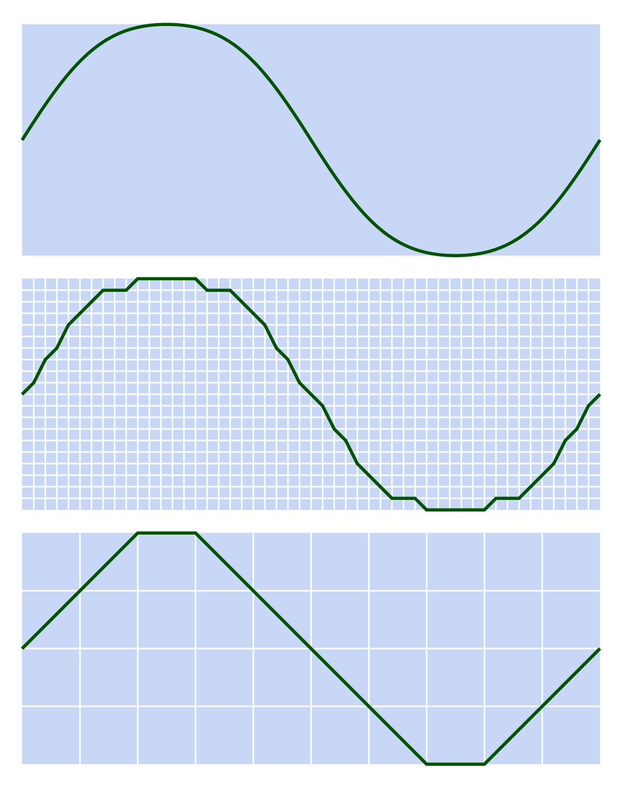
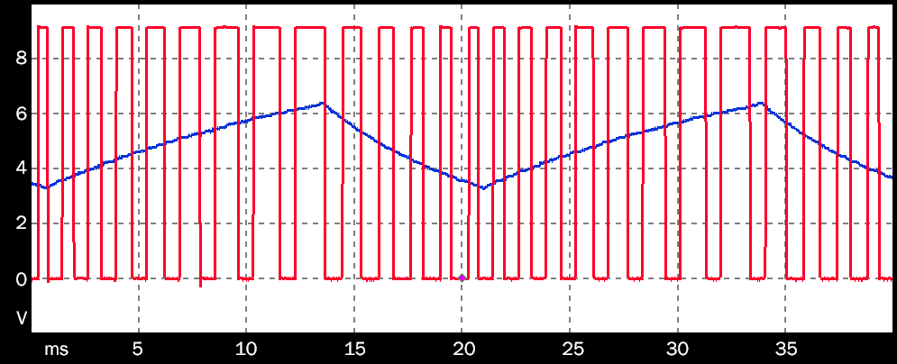
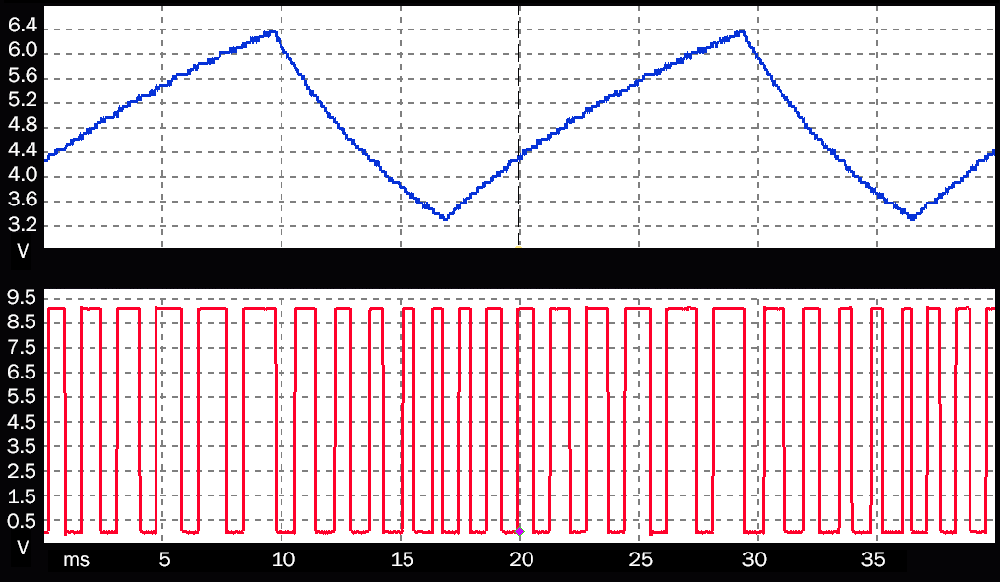

# Digital Oscilloscopes

This tutorial will explain some features that are slightly more advanced and may be available only on digital oscilloscopes \(more properly known as digital storage oscilloscopes, or DSOs\). Our two previous tutorials have described basic concepts and setup procedures, which will help build a solid foundation for the lessons in this tutorial.





### Digital Oscilloscopes Explained

Most oscilloscopes today are digital, meaning that they take rapid samples of an analog voltage and digitize the samples for manipulation and storage. This processing is done internally in benchtop and handheld oscilloscopes, while a USB oscilloscope typically offloads the task to a desktop or laptop computer.

### Bit Depth and Sampling Rate

The conversion of voltage samples into numbers that can be stored in memory is done by an analog-digital converter \(ADC\). This is comparable to the process of digitizing music for an MP3 file or a compact disc.

A typical moderately priced digital oscilloscope will use 8 bits \(binary digits\) to store 256 possible voltage values within the range selected by the user. Precision oscilloscopes may use 12 bits \(4,096 values\) or 16 bits \(65,536 values\) to store each voltage sample.

The speed of converting and storing samples will be limited by processing power. A digital oscilloscope may allow you to set the frequency and bit depth manually, but if the processor is unable to reach the frequency requested by the user, it may draw straight lines between points on the screen or may link them with little curves calculated with a trigonometry function.

This process of inferring missing data is known as interpolation. Figure 1 shows straight-line interpolation, beginning with an analog signal at the top, a rapidly sampled digital version with 20 voltage levels in the middle, and a slowly sampled version with only 5 voltage levels at the bottom.

Sampling rate is measured as MS/s \(megasamples per second\) or GS/s \(gigasamples per second\). The peak sampling rate quoted by a manufacturer may be attainable only when a single channel is in use; a second channel will almost double the processing requirements, and the sampling rate may diminish accordingly.

Ideally the sampling rate of a digital oscilloscope should be about 10 times the highest signal frequency that you will be measuring.

### Probe Attenuation

The most common type of oscilloscope probe has a little slide switch on its body, as shown in Figure 2. 1X is the normal position. The 10X position engages a resistor-capacitor combination inside the body of the probe which attenuates the measured voltage by a factor of 10. This allows you to measure voltages that are up to 10 times the usual limit for the oscilloscope. The higher resistance of a probe in its 10X setting also imposes less load on the circuit that you are testing, but you will lose accuracy at low voltages.

Your oscilloscope may have a setting that allows you to specify probes with different characteristics, such as 100X for dealing with very high voltages.

### Multiple Views

Almost all oscilloscopes have at least two channels, each of which can display a signal from a separate probe. This enables you to compare signals from more than one source.

For example, suppose you have two 7555 timer chips wired in astable mode, and one of them modulates the signal from the other. This can be done by taking the fluctuating voltage on the Threshold pin of the first chip and connecting it with the Control pin of the second chip. In Figure 3, the control voltage from the first chip is the blue triangular waveform while the square wave from the output of the second chip is red. You can see that when the control voltage increases, the frequency of the square wave decreases.

The two traces may also be displayed in a split screen, as in Figure 4. The VOLTS/DIV of each view can be adjusted separately, so that each trace fills its window.

### Advanced Triggering

On a digital oscilloscope, the basic triggering capability that I described in "How to Use An Oscilloscope" \(link above this article\) will have additional variations.

A simple edge trigger tells the oscilloscope to start capturing data either when the voltage rises up through a trigger threshold or drops down through it. A digital oscilloscope can be set to respond if either of these events occurs.

Hysteresis can be specified to eliminate false positives caused by a noisy signal. This setting basically tells the oscilloscope, "When voltage rises through a lower threshold, wait until the voltage continues to rise through a higher threshold." In the hysteresis zone between these levels, the oscilloscope ignores small variations. If the voltage drops back below the lower threshold without ever reaching the higher threshold, the triggering operation is cancelled until the next rise through the lower threshold occurs.

A hysteresis setting can also be used to sense a falling voltage that drops through a higher threshold followed by a lower threshold.

A window trigger detects voltage entering or leaving a window that may be defined visually on the screen.

All of these trigger options may help to detect events such as voltage spikes that are brief, intermittent, and difficult to see.

You may also set pre-trigger time or post-trigger delay to determine the moment when the signal will be displayed before or after the triggering event.

Pulse-width triggering detects pulses that are either longer or shorter than specified. This is useful for sensing momentary timing inaccuracies in a repeating signal.

### Measurements

Any digital oscilloscope should be able to derive immediate numeric measurements from a trace or a segment of a trace. These measurements will include the frequency of a signal, its minimum and maximum voltage, its average voltage, and its RMS value.

RMS is an acronym for root-mean-square, and is calculated by squaring each of a series of regularly spaced voltage measurements, finding the average of the squares, and then extracting the square root of the average. The result is equivalent in power to a DC voltage of the same value; thus 110V DC should cause an incandescent bulb to burn as brightely as 110V AC RMS, even though the AC signal will have higher peak values.

Other features may be available in oscilloscopes, but they are less commonly used or more technical than the ones listed here.

