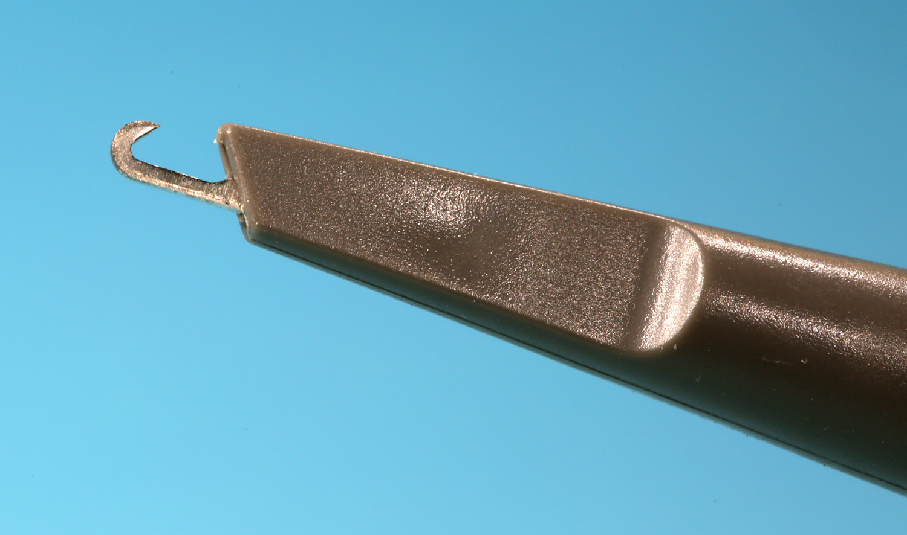
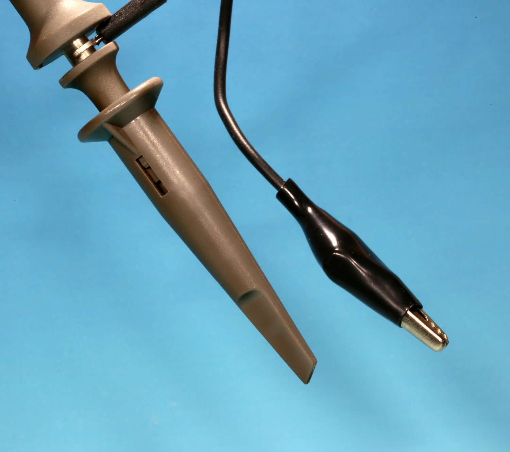
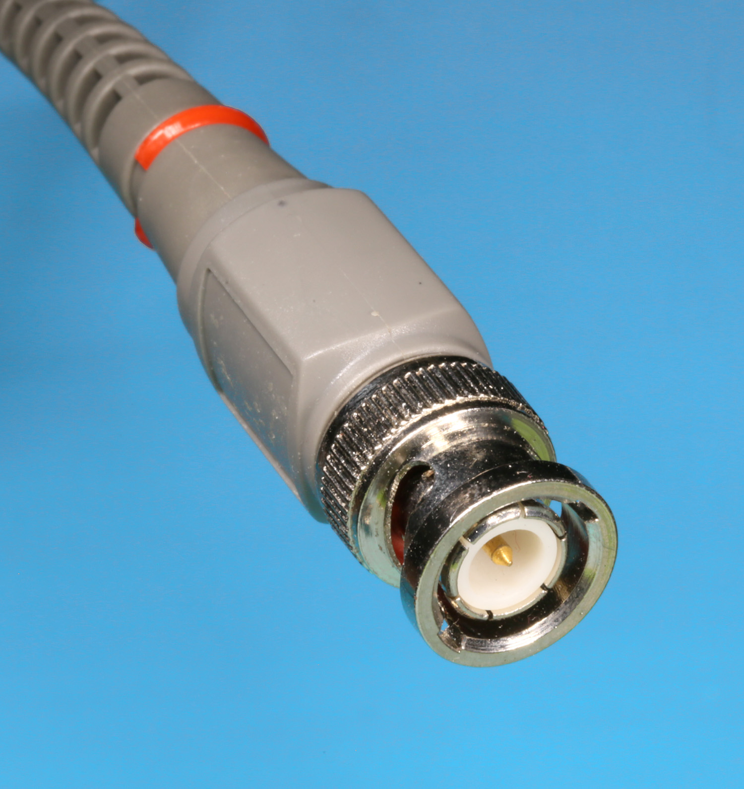
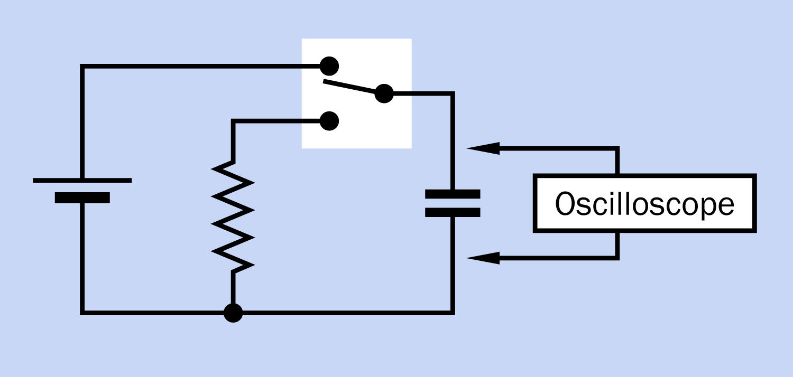
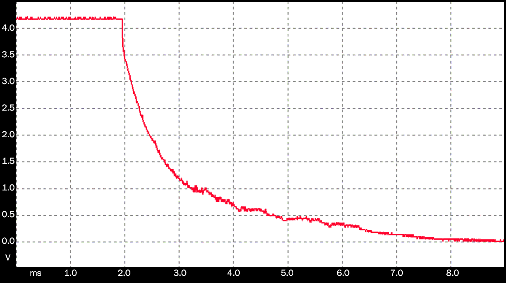

# How to Use an Oscilloscope

## How to Use an Oscilloscope

This tutorial explains how to set up an oscilloscope and then display a varying voltage as a trace that you scale to fit the screen.

### Oscilloscope Probes

Your oscilloscope detects voltage with a probe. When you retract the spring-loaded plastic collar at the end of the probe, as in Figure 1, it reveals a tiny metal hook that can grab the lead of a component on a circuit board. The probe also has a black wire terminating in an alligator clip that you attach to negative ground on the board. See Figure 2.

The other end of the cable from the probe terminates in a BNC plug, shown in Figure 3. Insert it into the "A" socket on your oscilloscope, as in Figure 4, and rotate the metal ring on the plug to lock it into position. A and B sockets may alternatively be identified as CH1 and CH2, meaning channels 1 and 2.

Note that while some oscilloscopes can be used with input voltages as high as 300V, others impose a much lower limit. Check your documentation for details.

If you buy a new USB oscilloscope, you will have to install a driver on your computer and connect the oscilloscope to the computer with a USB cable. The oscilloscope may power itself through the cable, or may use an AC adapter.

When you use it in AUTO mode, your oscilloscope will try to create a display from the voltage detected by the probe. If you simply touch your finger to the tip of the probe, you should see a trace. This will reassure you that the oscilloscope is working, but you will have to adjust the display to obtain a stable view, as described below.

### Basic Adjustments

Different types of oscilloscopes have different user interfaces. A handheld model will allow adjustments with buttons, while a benchtop version usually has some physical knobs. A USB oscilloscope may show you little pictures of knobs that you can "turn" with a mouse pointer, or it may use drop-down menus. In all of these variants, the basic concepts remain the same.

Voltage is displayed on the vertical scale at the left side of the screen, also known as the "Y axis." A knob or menu will let you choose the number of volts or millivolts for each division on the scale. This value is often abbreviated as VOLTS/DIV or may be referred to as "gain."

Time is displayed on the horizontal line at the bottom of the screen, also known as the "X axis." A knob or menu will let you choose the number of seconds, milliseconds, microseconds, or nanoseconds for each division on the scale. This value is often abbreviated as TIME/DIV or may be referred to as the "timebase."

While the oscilloscope will trigger itself in AUTO mode, you can choose to set a "trigger level" specifying when to start capturing and displaying data. Your oscilloscope may allow you to set the level as a percentage of the total voltage range, or as a specific voltage. You can choose to begin capturing either when the voltage sensed by the probe rises above the trigger level or falls below it.

After you obtain a useful trace, you can adjust its location, sometimes referred to as the "offset." Moving it may be done with arrow buttons or with knobs labelled Y-POS \(vertical position\) and X-POS \(horizontal position\). On a USB oscilloscope, you may be able to drag the trace using a mouse.

You can save the data that created the trace, reload it later, and adjust some of the attributes. Your oscilloscope may also be able to save a screen shot in a format such as bitmap or jpeg.

### Examples

To explore your options, you can use a simple test circuit in which a double-throw switch charges a capacitor from a battery and then discharges the capacitor through a resistor, as shown in Figure 5.

If you want to see the voltage on the capacitor when it discharges, you can try to capture it manually using RUN and STOP buttons on your oscilloscope, but you may not be able to do this quickly enough. A better option is to start capturing the data automatically by setting a trigger level.

Because the discharge of the capacitor in the circuit is a single event, you should select "one-shot" triggering in your oscilloscope. Then establish a level that is slightly below the voltage on the capacitor when it is fully charged, and set triggering to occur when the voltage falls below that level.

Ideally, you might prefer to start capturing the event a moment before the voltage drop occurs. This can be arranged quite easily, because a digital oscilloscope stores data in memory all the time. When the voltage drop begins, the scope has already stored the data that preceded it, and can generate a trace from that point onward. This is shown in Figure 6.

To make the trace fit neatly on the screen, you will have to set VOLTS/DIV to match the voltage range on the capacitor, then experiment with values for TIME/DIV. Each horizontal division in Figure 6 is 1 millisecond, but your ideal TIME/DIV will depend on the size of the capacitor, the value of the resistor, and the voltage of the power supply in your test circuit.

Note that all the screen shots in this tutorial have been cropped and relabelled for clarity, but each trace was saved without any editing. The small bumps in the trace in Figure 6 probably resulted from electrical noise.

Now suppose you want to capture a signal that repeats continuously, such as the output from a timer chip that has been wired asynchronously. When the oscilloscope is operating in "normal" mode, the trace on the screen updates itself frequently while you adjust VOLTS/DIV and TIME/DIV. You can immediately see the result of modifying a circuit, and you can also detect very brief events.

Figure 7 shows the continuous square-wave output from a 7555 timer chip. In Figure 8, you see how the signal changes if a capacitor is placed between the output pin of the chip and ground. The output voltage now rises slowly as the chip charges the capacitor, then drops more sharply as the capacitor discharges into the chip. To avoid overheating the chip with too much current, this test should not continue over a long period.

Disconnect the capacitor, remove the 7555, substitute a 555 timer wired asynchronously, and the result is shown in Figure 9. It looks almost identical to Figure 7 except that there is a short voltage spike at the beginning of each high segment of the trace. The 555 is a very old TTL design which is known to create a noisy output.

Your oscilloscope can magnify an image to show you what's happening, but if you try to view the voltage spike this way, you probably won't see enough detail. You need to sample the voltage more frequently, which will happen automatically if you decrease the value of TIME/DIV to focus on a briefer window in time. In Figure 10, the X axis is now calibrated in microseconds instead of seconds.

Figure 11 uses identical settings to reveal the output of a 7555 timer. You can see that the more modern CMOS design of the 7555 completely eliminates the transient spike of the 555, although the rise time of the output is a little slower.

What if you have a continuous signal that does not repeat, such as the output from a microphone? Begin with your oscilloscope in AUTO mode, then adjust TIME/DIV. Because every sample is now different, you may want to capture a rapid series of views. A typical digital oscilloscope can store 32 or more, allowing you to step through them after they have been saved to memory.

In the next tutorial we will share some more advanced features of oscilloscopes.

