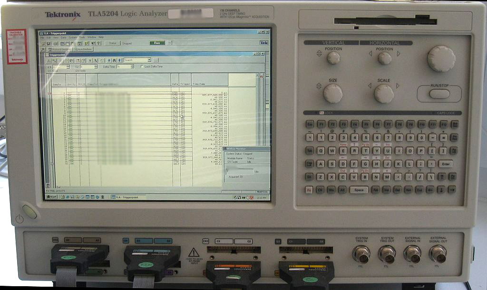

# What Is a Logic Analyzer?

## What Is a Logic Analyzer?

A logic analyzer is an instrument for capturing, displaying, and measuring multiple electronic signals simultaneously in a digital circuit. Logic analyzers are capable of showing the relationship and timing among many different signals in a digital system and are often capable of analyzing digital communication protocols, such as I2C, SPI, and Serial. As a result, a logic analyzer is the best tool for debugging digital circuits and digital communication systems.

### Filling a Need

The 1960s saw the rise of the integrated circuit \(IC\), which meant that circuits started to become smaller. In turn, thousands--eventually millions--of transistors could be packed into a single chip to perform complex digital logic operations, forming the basis for most microcontrollers, microprocessors, and field-programmable gate arrays \(FPGAs\) that we know today.

As transistor count and pin count grew on these ICs, testing and characterizing them became increasingly difficult. Oscilloscopes have been around since the 1930s, and while they are often considered the de facto test equipment for many electrical engineers, adding more than a handful of channels to an oscilloscope proved extremely costly.

In 1973, Hewlett Packard announced the invention of the first "Logic Anaylzer" that could measure and display digital logic across a set of LEDs. The HP 5000A was the first commercially available logic analyzer, but ut was limited to only two channels. In the years to come, commercial logic analyzers began boasting dozens of channels that could read and display digital logic in parallel.

Image credits: "[Tektronix Logic Analyzer TLA5204](https://commons.wikimedia.org/wiki/File:Tektronix_LogicAnalyzer_TLA5204.jpg)" by [Vonvon](https://commons.wikimedia.org/wiki/User:Vonvon) is licensed under [CC BY 3.0](https://creativecommons.org/licenses/by-sa/3.0/deed.en)

The oscilloscope is still the perfect tool for analyzing how analog voltages between two points varies over time on up to 4 channels \(some oscilloscopes offer more channels, but 2-4 channels are the most common\). Even for digital systems, an oscilloscope can be great for measuring things like rise and fall times, ringing, power consumption, jitter, propagation delays, and setup-and-hold times. If you require a higher channel count to trace and correlate multiple digital signals simultaneously, a logic analyzer is the right tool for the job.

### What Makes a Logic Analyzer Unique

* Record one or more digital signals simultaneously
  * Potentially start recording based on a trigger
  * Potentially record analog signals at the same time \(mixed-signal oscilloscope\)
* Display the signals
  * On-device or computer application
  * Store-and-display vs. real-time display
  * Navigate \(zoom, pan, etc.\)
  * %%%gif of navigating through signals%%%
* Measure the signals
  * Pulse width
  * %%%screenshot of pulse width%%%
  * Frequency, period, duty cycle
  * %%%screenshot of freq/period/duty cycle%%%
  * Time between events \(e.g. setup and hold time\)
  * %%%screenshot of measuring setup and hold%%%
* Search for a pattern
  * Search within previously recorded data
  * %%%screenshot of searching for pattern%%%
  * Start recording when pattern is seen \(trigger\)
* Interpret signals \(protocol analyzer\)
  * List examples of protocols supported by Saleae analyzer
  * %%%screenshot of analyzed Serial data%%%

### Form Factors

Portable logic analyzer \(instrument chassis\) Modular logic analyzer \(modules that plug into a mainframe\) PC-based logic analyzer \(standalone units that plug into a computer via USB, Ethernet, etc.\)

### How a Logic Analyzer Works

Input is digitized: thresholds for TTL, CMOS, user-defined. 0 for low, 1 for high.

Sync \(state\) vs async \(timing\) clocking

All channels are sampled simultaneously and stored in memory

When trigger condition is met, contents in memory are displayed. Triggers can be user pushing button, single channel transition, several channel states, pattern in one or more channels.

Various tools can help the user browse through the data, search for patters, and analyze protocols.

### Why Would You Need a Logic Analyzer?

What kinds of problems can LAs help you solve?

Measure the time between events.

Debug protocols such as UART, SPI, I2C, etc.

Test and characterize firmware \(toggle GPIO at the beginning and end of events\)--interrupts, sleep, power

Reverse engineer undocumented digital hardware

