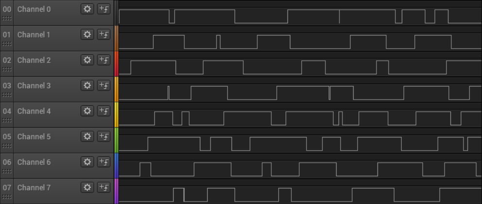
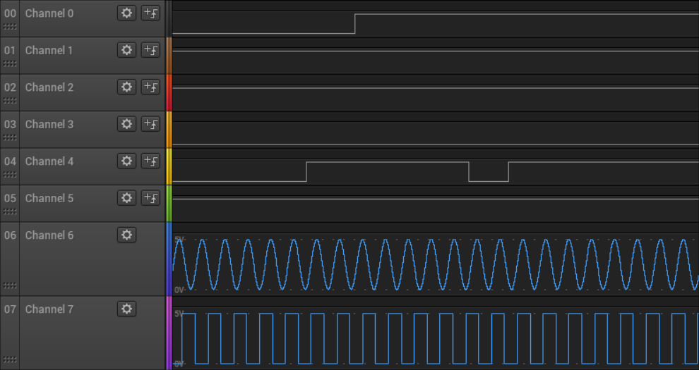
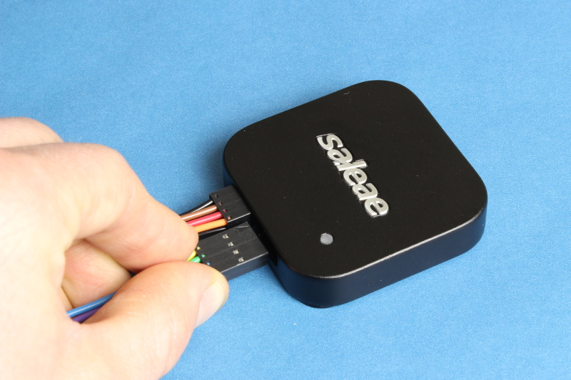
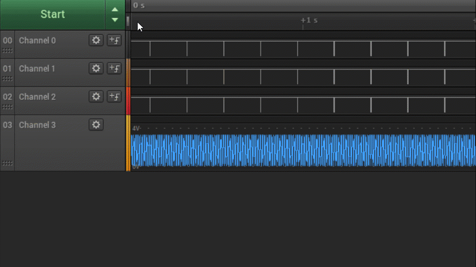
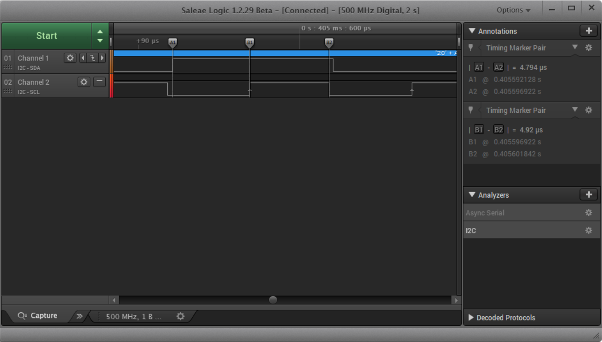
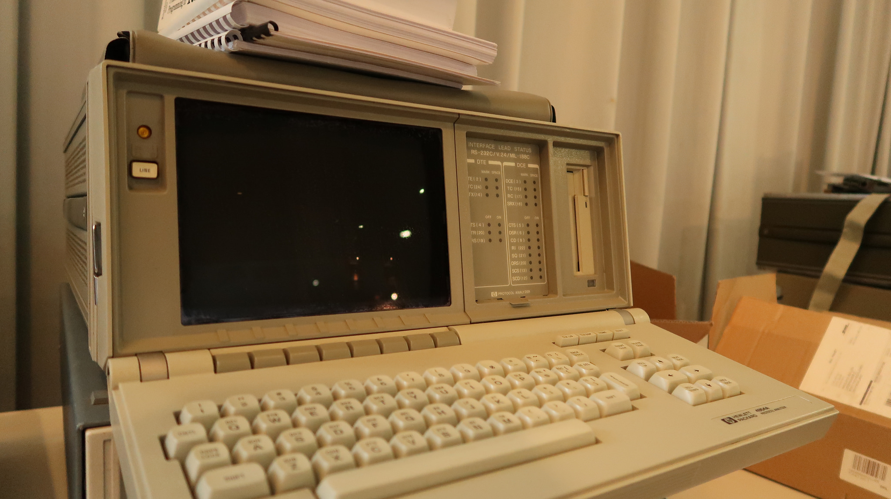
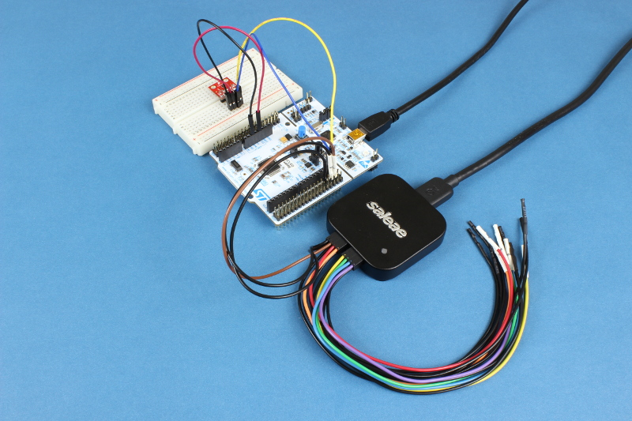

# What Is a Logic Analyzer?

## What Is a Logic Analyzer?

A logic analyzer is an instrument for capturing, displaying, and measuring multiple electronic signals simultaneously in a digital circuit. Logic analyzers are capable of showing the relationship and timing among many different signals in a digital system and are often capable of analyzing digital communication protocols, such as I2C, SPI, and Serial. As a result, a logic analyzer is the best tool for debugging digital circuits and digital communication systems.

### Invention of the Logic Analyzer

The 1960s saw the rise of the integrated circuit \(IC\), which meant that circuits started to become smaller. In turn, thousands--eventually millions--of transistors could be packed into a single chip to perform complex digital logic operations, forming the basis for most microcontrollers, microprocessors, and field-programmable gate arrays \(FPGAs\) that we know today.

As transistor count and pin count grew on these ICs, testing and characterizing them became increasingly difficult. Oscilloscopes have been around since the 1930s, and while they are often considered the de facto test instrument for many electrical engineers, adding more than a handful of channels to an oscilloscope proved extremely costly.

In 1973, Hewlett Packard announced the invention of the first "Logic Anaylzer" that could measure and display logic states across a set of LEDs. The HP 5000A was the first commercially available logic analyzer but was limited to only two channels. In the years to come, commercial logic analyzers began boasting dozens of channels that could read and display digital logic in parallel.

The oscilloscope is still the perfect tool for analyzing how analog voltages between two points varies over time on up to 4 channels \(some oscilloscopes offer more channels, but 2-4 channels are the most common\). Even for digital systems, an oscilloscope can be great for measuring things like rise and fall times, ringing, power consumption, jitter, and propagation delays. If you require a higher channel count to trace and correlate multiple digital lines simultaneously, a logic analyzer is the right tool for the job.

### What Makes a Logic Analyzer Unique

#### Recording Several Input Channels

The biggest advantage of a logic analyzer is its ability to record a large number digital signals simultaneously, typically 8 to 100 channels. While oscilloscopes can also record digital data, they typically cannot match the same number of channels as a logic analyzer due to the memory requirements of storing analoag data.

#### Complex Digital Triggering

Similar to oscilloscopes, logic analyzers can be configured to begin recording on a trigger event. Triggers can be as simple as a single rising or falling edge of a particular channel, or they can be a complicated set of conditions that include edges or states of multiple channels.

#### Mixed-Signal Capability

Many modern logic analyzers include some oscilloscope functionality and vice versa. These new tools, capable of recording and analyzing digital as well as analog waveforms, are known as _mixed-signal oscilloscopes_. Test equipment that serve multiple purposes can make characterizing complex circuits and systems easier.

#### Portability

Many standalone logic analyzers include screens capable of displaying the captured signal data. However, as personal computers become more powerful with faster peripheral ports \(for example, USB 3.0\), some logic analyzers forgo the screen and rely on computer software to perform the analysis. This saves on equipment size and costs.

#### Ease of Data Navigation

Most logic analyzers work by capturing digital data, storing it in a buffer, and then displaying it on a screen. Some are capable of showing signals in real-time, much like an oscilloscope. While this can be useful to look for trends while a system is running, it can be difficult to search through and look for details in the signals.

Logic analyzers, whether standalone or attached to a computer, usually include software or controls for navigating through large amounts of signal data. This can include zooming, panning, searching, etc.

#### Quick Digital Measurements

Modern logic analyzers and logic analyzer software contain many advanced features that help users characterize signals. This includes measuring aspects of the signal, such as pulse width, frequency and period of periodic signals, as well as duty cycle.

If you are analyzing transmission data between two systems, a logic analyzer can be an invaluable tool for timing analysis. For example, with I2C, the data line \(SDA\) needs to be held at its intended value for a particular amount of time \(part dependent\) before the rising edge of the clock line \(SCL\). This is known as _setup_ time. For most implementations of I2C, SDA also needs to be held at its intended value until the subsequent falling edge of SCL. This is known as _hold_ time.

A logic analyzer with a fast enough sample rate can help measure setup and hold times, which can help ensure your messages are being read by the receiver.

#### Decode and Search Transmitted Data

Another unique feature of logic analyzers is the ability to decode signals. Most modern digital communication is implemented based on a set of protocols. Logic analyzers or their associated software can include these protocols, known as _protocol analyzers_, to help you make sense of the captured data. Some of the popular protocols include: SPI, I2C, Serial \(UART/USART\), 1-Wire, CAN, UNI/O, I2S/PCM, JTAG, HDMI CEC, PS/2, and USB.

With recorded data, many logic analyzers will allow you to search through the data looking for particular patterns. For instance, in our I2C example, we can look for the device's bus address, as that will denote the beginning of a transmission. Some logic analyzers will let you set a search pattern as the trigger condition to begin recording.

### Form Factors

Logic analyzers can generally be found in one of three forms: portable, modular, and PC-based. _Portable logic analyzers_ have the more traditional "test equipment" form factor, often larger than most workbench oscilloscopes. They are considered "portable" as they include everything required to capture, view, and analyze digital signals such as probes, a screen, cursor controls, and sometimes a full keyboard.

_Modular logic analyzers_ are rack- or PC-mounted cards that slide into a mainframe or backplane. The are considered "modular" because the end user can purchase and swap out various acquisition and test modules on a single backplane depending on their needs. 

_PC-based logic analyzers_ rely on computers to perform the heavy lifting of displaying and analyzing the captured data. PC-based logic analyzers include a separate device that is plugged in to one of the computer's accessory ports. The device houses the necessary data acquisition circuitry for capturing multiple, high-speed digital signals. This information is sent to computer software over the connected port. Due to the speed requirements to transmit large amounts of captured data, most PC-based logic analyzers rely on high-speed, wired connections, such as USB or Ethernet.

### Why Would You Need a Logic Analyzer?

Oscilloscopes can measure digital signals in much the same way but are limited by the number of channels available. An oscilloscope is the right tool for measuring how the voltage between two points in a circuit varies or fluctuates over time. 

However, logic analyzers can be extremely useful for testing, debugging, and characterizing digital circuits with several advantages over oscilloscopes:

 * More channels than an oscilloscope
 * Characterize the output of a digital circuit (e.g. FPGAs)
 * Debug complex embedded firmware by toggling general purpose input/output \(GPIO\) pins
 * Quickly measure and decode various digital protocols
 * PC-based logic analyzers can be great for debugging in the field 

Looking for some logic analyzers? Check out the intuitive, PC-based [logic analyzers by Saleae](https://www.saleae.com/).
